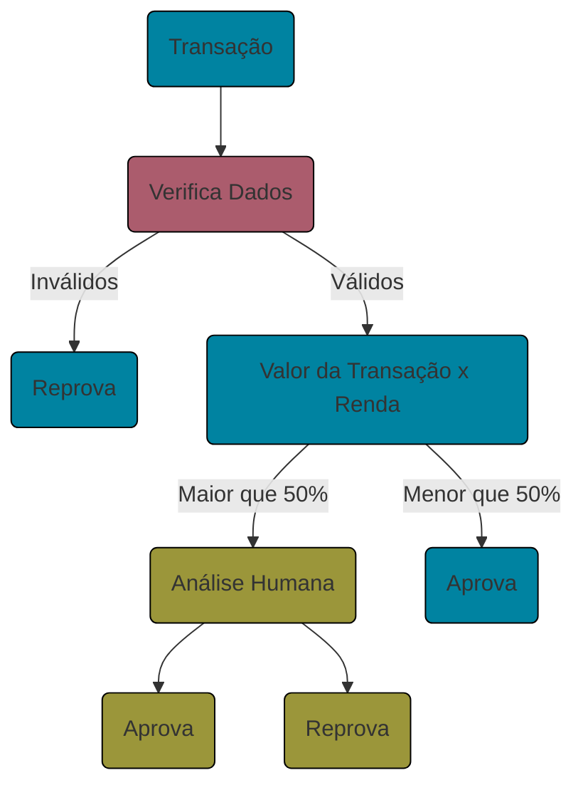

# DEVastation 

 

Este é o projeto final do curso de formação **NxtDev da PagoNxt**. O projeto consiste em uma Arquitetura de Microserviços responsável por **detectar fraudes de pagamento**, dividida em três serviços:

- **Clientes**,
- **Prevenção de Fraudes**,
- **Transações**.

## Fluxo dos Serviços

•  Clientes  •   Prevenção de Fraudes  •  Transações •

## Tecnologias

 

       

## Como Rodar a Aplicação

No terminal, clone o projeto. 

    https://github.com/Brazil-I-m-DEVastated/DEVastation.git

Instale as dependências necessárias para cada serviço

    npm install
    
Use o Docker Compose para subir os containers de todos os serviços

    docker-compose up
    
Rode os testes de cada serviço

    npm run test

Acesse a documentação das API:

Use as coleções do Postman para rodar os Endpoints. 

### Autenticação

Na **API-Gateway** temos uma query do mongo para popular o banco com usuários autenticados. Após rodar a query, utilize uma das contas para acessar a aplicação:

    email: fernandoleandrobernardes@example.com.br
    password: aloha
    
ou 

    email: ianfernandoribeiro@example.com.br
    password: ian123
    
  
## Time 

Squad Clientes
  
  
  
  
Squad Prevenção de Fraude 

  
  
  

Squad Transactions

  
  

